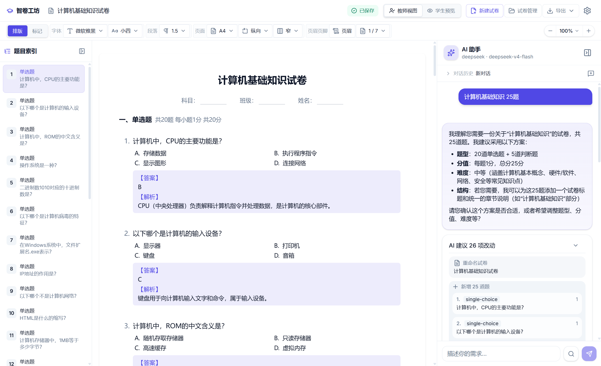
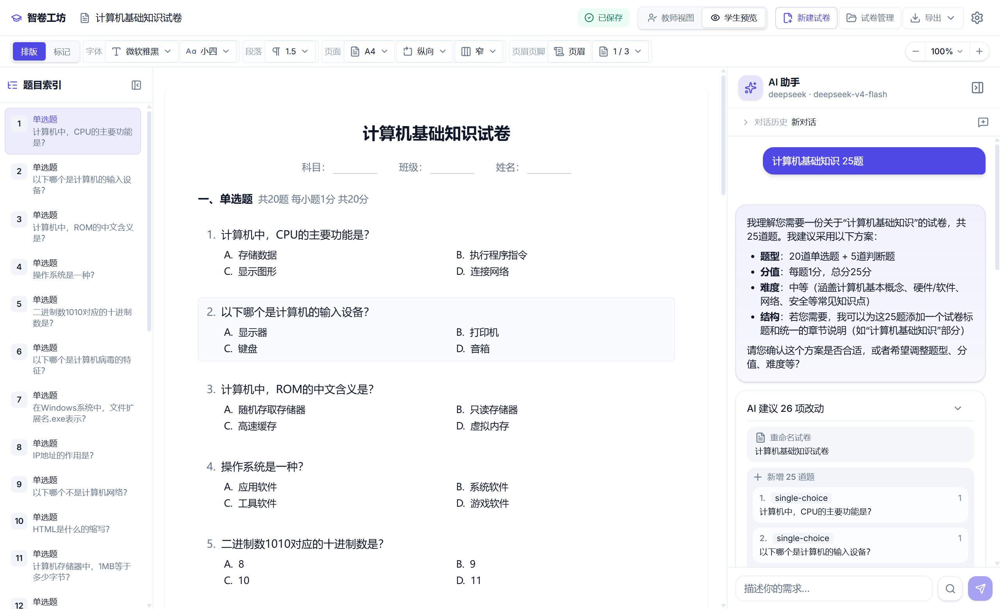
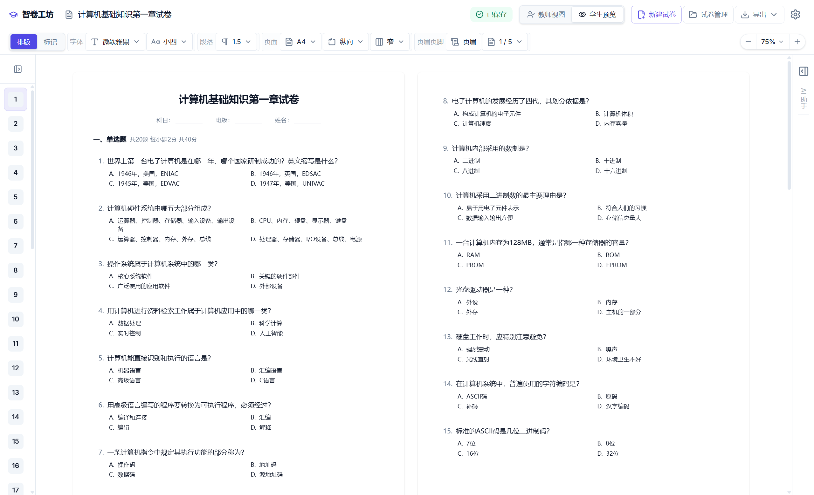
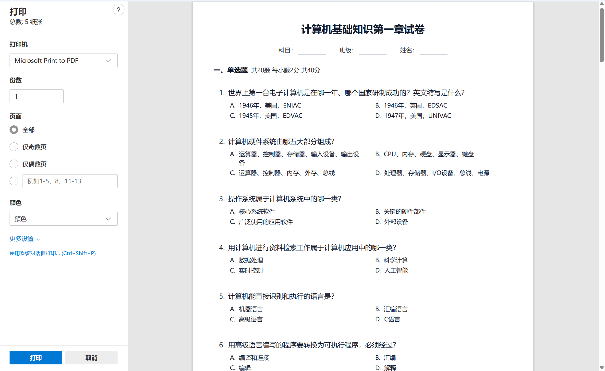
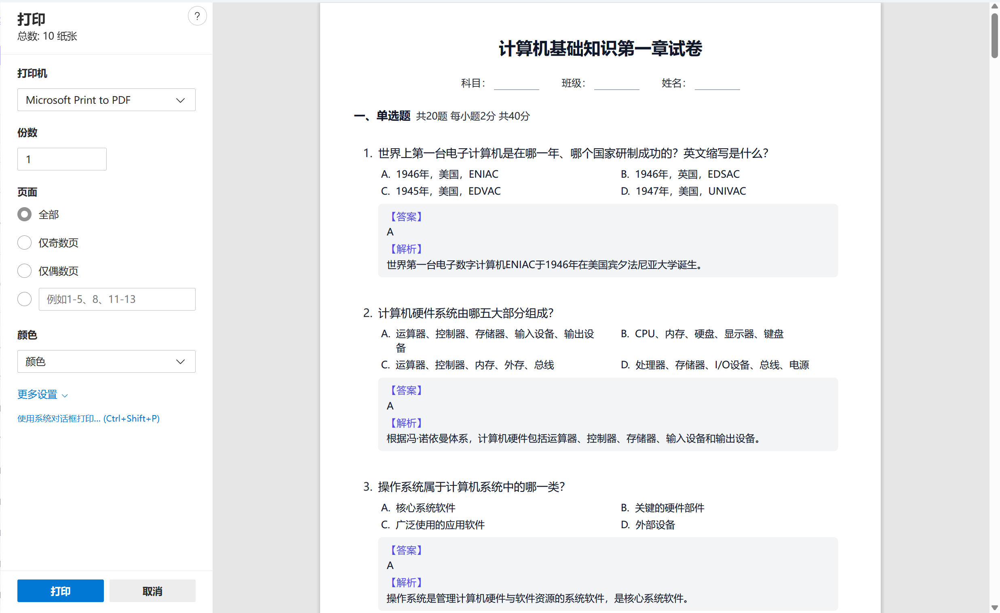
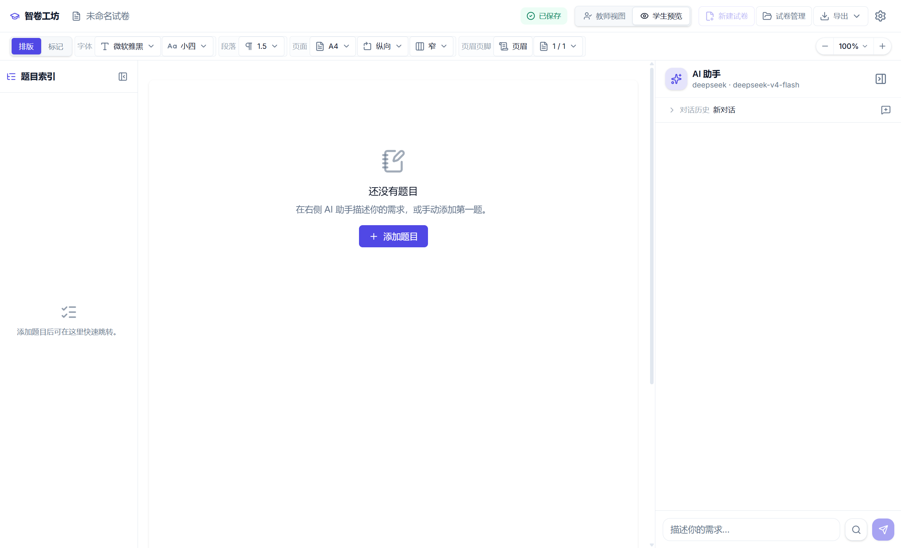
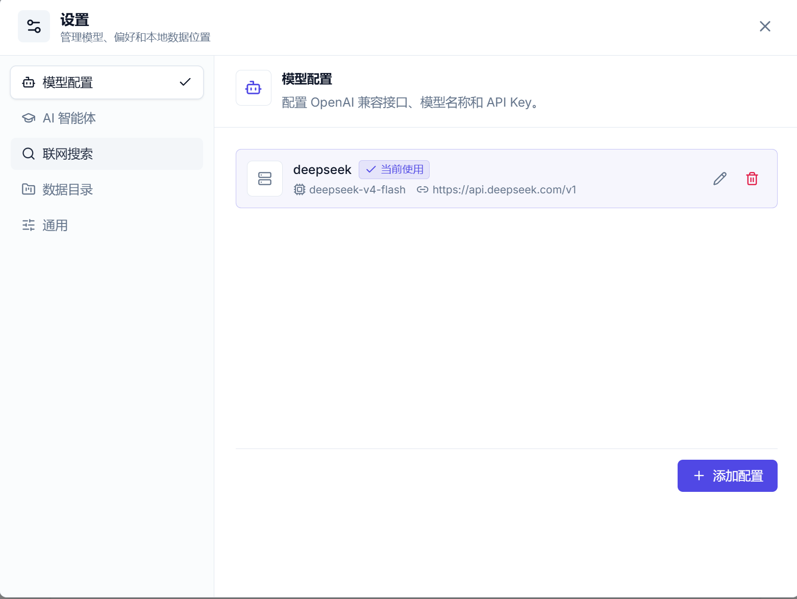
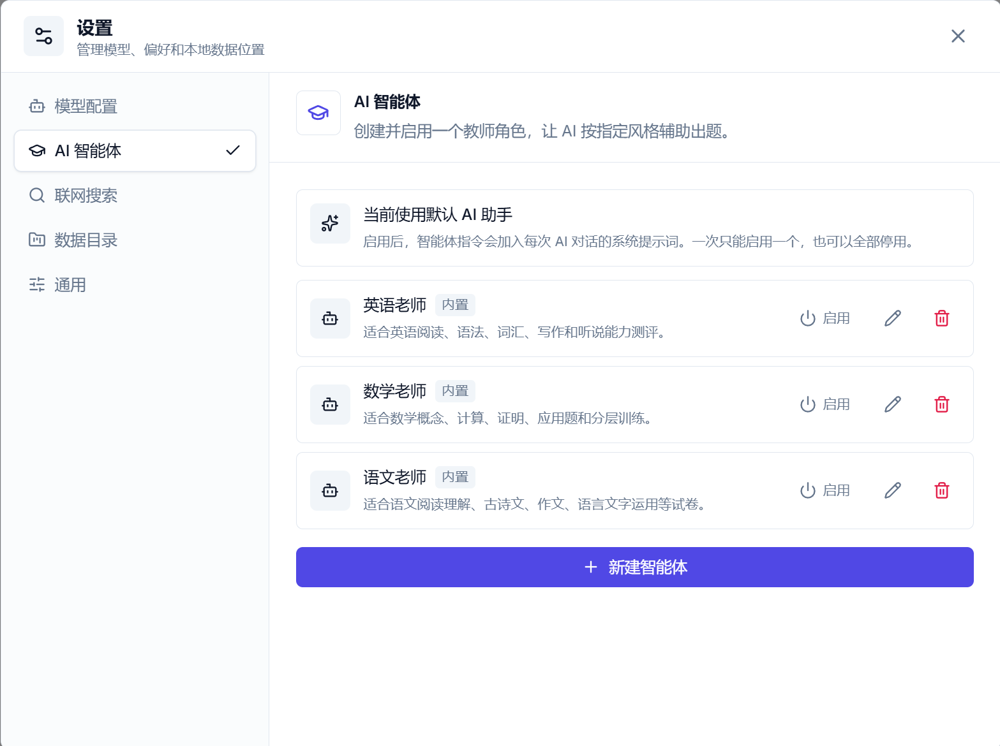

**English** · [简体中文](./README.md)

<p align="center">
  
</p>

<h1 align="center">ExamCraft AI</h1>

<p align="center">
  A local-first desktop workspace for generating, editing, previewing, and printing exam papers with AI.
</p>

<p align="center">
  <a href="https://github.com/DreZeo/examcraft-ai/releases">Download for Windows</a>
  ·
  <a href="./LICENSE">MIT License</a>
</p>

ExamCraft AI is a Tauri desktop application for teachers, trainers, and education content creators. It turns natural-language requirements into structured exam questions, validates the generated JSON before it can affect the paper, and renders the result as a Word-like paginated paper that can be previewed, printed, exported, and revised.

The project is designed around one practical idea: AI should help draft the exam, but the teacher keeps control. The assistant analyzes the request, asks for confirmation, can search the web when needed, and returns an auditable result card. Nothing is applied automatically.

## Interface Preview

<table>
  <tr>
    <td width="50%">
      <h3>Paper Workbench</h3>
      
    </td>
    <td width="50%">
      <h3>Student Preview</h3>
      
    </td>
  </tr>
  <tr>
    <td width="50%">
      <h3>Multi-page Zoom</h3>
      
    </td>
    <td width="50%">
      <h3>Print Layout Preview</h3>
      
    </td>
  </tr>
  <tr>
    <td width="50%">
      <h3>Teacher Export Preview</h3>
      
    </td>
    <td width="50%">
      <h3>Empty Paper State</h3>
      
    </td>
  </tr>
  <tr>
    <td width="50%">
      <h3>Model Settings</h3>
      
    </td>
    <td width="50%">
      <h3>AI Agents</h3>
      
    </td>
  </tr>
</table>

## Highlights

- **AI-assisted paper drafting** — describe the subject, grade, difficulty, question mix, scoring rules, and special constraints in natural language.
- **Two-phase generation flow** — the assistant first analyzes and confirms the plan, then generates the final question operations.
- **Strict schema validation** — generated content is parsed and validated before it can be applied, with self-correction retries for malformed JSON.
- **Search-grounded generation** — optional Tavily, Exa, or Firecrawl search tools let the model gather current context before writing questions.
- **Word-like paper layout** — configure paper size, orientation, margins, font, Chinese font size presets, line height, header, footer, page numbers, and preview zoom.
- **Live paginated preview** — see the paper as physical pages, including teacher and student variants.
- **Print and export workflow** — export JSON project files, import saved papers, export Markdown, and print PDF-style teacher/student versions through the live layout.
- **Rich question rendering** — Markdown, GFM tables, KaTeX formulas, and syntax-highlighted code blocks are supported in question content and answers.
- **Local-first storage** — papers, the working document, and chat history live in a user-selected data directory.
- **Safe data relocation** — changing the data directory migrates existing data first, then switches paths; optional cleanup can remove the old directory after a successful move.
- **Secure secret handling** — model and web-search API keys are stored in the operating system keychain, not in plaintext config files.
- **Bilingual UI** — English and Simplified Chinese interfaces are available.

## What Makes It Different

Many AI tools can produce a block of questions. This app focuses on the full teacher workflow after that first draft:

- The assistant output is treated as **structured operations**, not raw text.
- Validation protects the paper from invalid question data.
- The preview uses a **document-like layout model**, so editing decisions are made against the printed result.
- Teacher and student versions are separate views of the same paper data.
- Web search is part of the generation turn, so the model can run multiple searches and continue with the gathered context.
- Data storage is explicit and portable instead of hidden behind a cloud account.

## Core Workflow

1. **Choose a data directory** on first launch. This is where papers, chats, and local configuration are stored.
2. **Configure a model** in Settings. Any OpenAI-compatible endpoint can be used.
3. **Create or open a paper** from the paper manager.
4. **Ask the AI assistant** for a paper or a set of changes.
5. **Review the assistant's analysis** and confirm before generation.
6. **Inspect the result card** and apply the generated operations only when satisfied.
7. **Adjust layout and markup** with the toolbar while watching the paginated preview.
8. **Export or print** the teacher/student version.

## AI Generation

The assistant uses a controlled two-phase flow:

- **Phase 1: analysis and confirmation** — the model summarizes intent, question strategy, difficulty, scoring, and constraints.
- **Phase 2: structured generation** — the model returns JSON operations that are validated before they can update the paper.

Supported question types:

- Single choice
- Multiple choice
- True / false
- Fill in the blank
- Short answer
- Essay
- Calculation

Generated questions can include scoring points, explanations, reference answers, code snippets, formulas, and Markdown content. JSON extraction is designed to handle fenced code blocks inside question text, which is important for programming exams.

## Web Search

Web search can be enabled from the assistant input. When enabled, the model can request searches during the same generation turn instead of relying only on the original user prompt.

Supported providers:

- Tavily
- Exa
- Firecrawl

Search settings include active provider, result count, and content mode. Search API keys are configured in Settings and stored through the OS keychain.

## AI Agents

The app includes configurable assistant personas for subject-specific paper generation and revision.

## Paper Layout

The preview is built for exam-paper production rather than a generic text editor. It includes:

- Paper sizes: A3, A4, A5, B5, Letter, Legal, Executive
- Portrait and landscape orientation
- Word-like margin presets
- Paper font presets, including common Chinese fonts
- Chinese font size presets such as 小五、五号、小四、四号
- Line-height presets
- Header text with alignment and smaller font-size presets
- Footer page number presets: `1`, `1 / 5`, `第 1 页`, `第 1 页 / 共 5 页`
- Optional header/footer separator lines
- Preview zoom: fit width, fit page, and fixed percentages
- Responsive workbench scaling for smaller windows

The preview supports teacher and student modes. Teacher mode shows answers and explanations; student mode hides answers and keeps answer space where needed.

## Export and Printing

Available output workflows:

- **JSON export/import** — save and restore complete paper data.
- **Markdown export** — export teacher or student content for backup or external editing.
- **Print/PDF** — print the live teacher or student page layout.

The print workflow reuses the current paginated paper layout so exported output stays close to the preview.

## Data and Privacy

The app is local-first:

- `config.json` stores non-sensitive settings.
- `working-paper.json` stores the active working paper.
- `papers/` stores saved papers.
- `chats/` stores assistant conversations.
- API keys are stored in the OS keychain.

When relocating the data directory, the app copies the existing directory contents to the target first and only updates the bootstrap path after the copy succeeds. The old directory is kept by default as a backup, with an optional cleanup switch.

## Model Configuration

The app supports OpenAI-compatible chat completion endpoints. Examples include:

- OpenAI
- DeepSeek
- Ollama-compatible local endpoints
- Self-hosted or relay endpoints that follow the OpenAI API shape

Each model configuration can define:

- Display name
- Base URL
- Model name
- API key
- Temperature
- Max tokens

API keys are loaded into password-style fields by default, with an eye button for temporary reveal.

## Tech Stack

- **Frontend:** React 19, TypeScript, Vite 7, Tailwind CSS v4, Zustand, Zod, i18next
- **Content rendering:** react-markdown, remark-gfm, remark-math, rehype-katex, rehype-highlight
- **Desktop backend:** Tauri 2, Rust, serde, tokio, reqwest
- **Storage and security:** JSON file storage, OS keychain integration
- **Testing:** Vitest, Testing Library, Rust unit tests

## Getting Started

### Prerequisites

- Node.js 20.19+ or 22.12+
- Rust stable via [rustup](https://rustup.rs/)
- Platform-specific Tauri prerequisites from the [Tauri guide](https://tauri.app/start/prerequisites/)

### Install

```bash
npm install
```

### Run in development

```bash
npm run tauri dev
```

For the frontend-only Vite dev server:

```bash
npm run dev
```

### Build

```bash
npm run tauri build
```

### Validate

```bash
npm run typecheck
npm test
cargo check --manifest-path src-tauri/Cargo.toml
cargo test --manifest-path src-tauri/Cargo.toml
```

## Project Structure

```text
src/
  components/
    assistant/      Chat UI, result cards, confirmation, web search cards
    layout/         Top bar, toolbar, export menu
    paper/          Paginated paper preview, outline, question blocks
    settings/       Model, web search, general, and data directory settings
    ui/             Shared controls such as secret inputs and selects
  hooks/            Theme and global font hooks
  i18n/             English and Chinese locale files
  lib/
    api/            AI prompts, JSON extraction, validation, search tool protocol
    exam/           Paper domain logic, pagination, summaries, question helpers
    export/         JSON and Markdown export/import
    storage/        Tauri storage bridge
    types/          Config, paper, and library schemas
  stores/           Zustand stores for paper, config, assistant, export state

src-tauri/
  src/
    lib.rs          Tauri command registration and runtime setup
    openai.rs       OpenAI-compatible streaming client
    web_search.rs   Tavily / Exa / Firecrawl search integration
    storage.rs      Data directory, JSON storage, relocation
    keychain.rs     OS keychain API key storage
```

## Acknowledgements

Thanks to [unity2.ai](https://unity2.ai) for technical support.

## License

This project is open-sourced under the [MIT License](./LICENSE).
